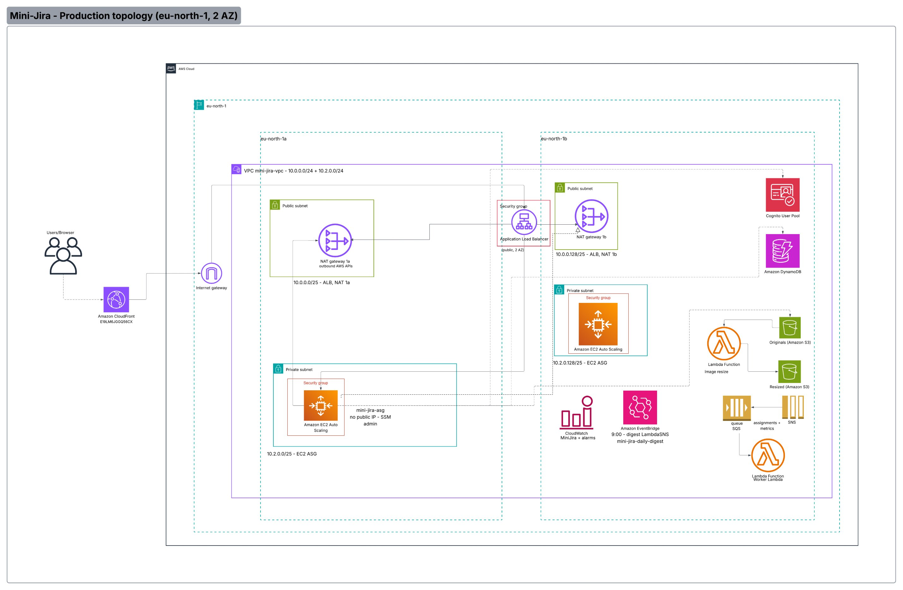

# Mini-Jira

| | Link |
|--|------|
| **Live app** | [https://d2nnx11y19xl0z.cloudfront.net](https://d2nnx11y19xl0z.cloudfront.net) |
| **Architecture diagram** | [See below](#architecture) |
| **Demo video** | [Google Drive](https://drive.google.com/file/d/1JhPeVro-dHBWrCVYjoSIvq69nlXOPXYS/view?usp=sharing) |

A lightweight team task-management app — think stripped-down Jira — fully deployed on AWS. Managers assign tasks across teams, employees see only their own team's work, and the entire backend is event-driven using SNS, SQS, EventBridge, and Lambda.

**Region:** `eu-north-1` · **Repository:** [github.com/Eyad3skr/Mini-Jira](https://github.com/Eyad3skr/Mini-Jira)

---

## Authentication

Sign in with **AWS Cognito**. Demo accounts (configured in the user pool):

| User | Role | Scope |
|------|------|--------|
| **Ali Hassan** | Manager | All tasks; assign across teams |
| **Sara Ahmed** | Employee (Frontend) | Frontend team only |
| **Omar Khaled** | Employee (Backend) | Backend team only |

Team boundaries are enforced server-side — not just hidden in the UI. Every API handler calls `assertTaskAccess`, which validates the Cognito JWT and checks the caller's `teamId` attribute against the task's `teamId` in DynamoDB. An employee cannot fetch another team's task even by guessing its ID.

---

## Architecture



The system runs across two Availability Zones (`eu-north-1a` and `eu-north-1b`) inside a single VPC (`10.0.0.0/24 + 10.2.0.0/24`):

- **Public subnets** — Application Load Balancer and NAT Gateways (one per AZ)
- **Private subnets** — EC2 Auto Scaling Group instances (no public IP, accessed via SSM)
- **CloudFront** (`E19LM6JGGQ56CX`) sits in front of the ALB for global low-latency delivery
- **Internet Gateway** is the single ingress point; all outbound traffic from private subnets routes through the NAT Gateways

| Document | Description |
|----------|-------------|
| [docs/AWS-SERVICES.md](docs/AWS-SERVICES.md) | AWS services: wiring, flows, and why each is used |
| [docs/ARCHITECTURE.md](docs/ARCHITECTURE.md) | System design, data model, monitoring |
| [infrastructure/AWS-DEPLOYMENT.md](infrastructure/AWS-DEPLOYMENT.md) | Deployment checklist and resource IDs |
| [infrastructure/VPC-PRIVATE-EC2-MIGRATION.md](infrastructure/VPC-PRIVATE-EC2-MIGRATION.md) | VPC layout and private EC2 runbook |

---

## Backend

### API Design

The backend is an **Express.js** API running on Node.js, deployed across two EC2 instances in the Auto Scaling Group and kept alive by `pm2`. All routes are versioned under `/api/v1`.

**Auth middleware** runs on every request:
1. Extracts the Bearer token from the `Authorization` header
2. Verifies the JWT signature against the Cognito User Pool's JWKS endpoint
3. Decodes `custom:role` and `custom:teamId` from the token claims
4. Attaches them to `req.user` for downstream handlers

**Team isolation** is enforced at the query layer via `assertTaskAccess`:
- Employees: DynamoDB query uses the GSI on `teamId`, scoped to `req.user.teamId`
- Managers: bypass the filter and query the full Tasks table

Key route groups:

| Route | Method | Role | Description |
|---|---|---|---|
| `/tasks` | GET | Manager / Employee | List tasks (team-scoped for employees) |
| `/tasks` | POST | Manager | Create task, trigger SNS assignment event |
| `/tasks/:id` | PATCH | Employee / Manager | Update status; audit log entry written |
| `/tasks/:id/image` | PUT | Manager | Replace image; old version retained in S3 |
| `/projects` | GET / POST / PATCH / DELETE | Manager | Full project CRUD |
| `/comments` | GET / POST | Both | Per-task comment thread |

### AWS Services Wiring

**Task assignment flow (SNS → SQS → Lambda):**
```
Manager creates task (POST /tasks)
  │
  ▼
Express API → SNS topic (task-assignments)
  │
  ├─► Email subscription → assignee notified immediately
  │
  └─► SQS queue (assignments-queue)
        │
        ▼
      Worker Lambda (drains queue)
        ├─► Writes activity log entry to DynamoDB
        └─► Publishes custom CloudWatch metric: TasksAssignedPerTeam
```

**Image upload flow (S3 → Lambda):**
```
Employee attaches image to task
  │
  ▼
Express API → S3 PUT (originals bucket)
  │
  ▼
S3 PUT event triggers Lambda (image-resize)
  │
  ▼
Resized thumbnail written to S3 (resized bucket)
DynamoDB Tasks table updated with both image URLs
```

**Daily digest (EventBridge → Lambda → SNS):**
```
EventBridge scheduled rule (cron: 9:00 AM daily)
  │
  ▼
Lambda (mini-jira-daily-digest)
  │  Scans DynamoDB Tasks table for tasks due today
  ▼
SNS → digest email sent to each assignee
```

**CloudWatch monitoring:**
- Dashboard `MiniJira` — 4 widgets: tasks created per day, tasks closed per day per team, average time-to-close, EC2 CPU utilization
- Alarm `mini-jira-tasks-created-activity` → SNS topic `mini-jira-alarms`
- Custom metrics namespace: `MiniJira`

### DynamoDB Data Model

| Table | Partition Key | Sort Key | GSIs |
|---|---|---|---|
| Tasks | `taskId` | — | `teamId-index`, `assigneeId-index` |
| Projects | `projectId` | — | — |
| Comments | `taskId` | `commentId` | — |
| Users | `userId` | — | — |
| Teams | `teamId` | — | — |

The `teamId-index` GSI is what makes team isolation possible at the database level — queries never touch rows outside the caller's team.

---

## Local vs Production

| | Local | Production |
|--|--------|------------|
| **URL** | http://localhost:5173 | CloudFront (link above) |
| **Auth** | `DEV_AUTH=true`, `VITE_DEV_MOCK_LOGIN=true` | Cognito OIDC |
| **Database** | DynamoDB Local (`docker compose`) | AWS DynamoDB |
| **API** | `npm run dev:api` (:3001) | Express on EC2 ASG behind ALB |
| **Frontend** | `npm run dev` | Built on EC2 with production `.env` |
| **Instance access** | — | SSM Session Manager |

---

## Local Development

**Prerequisites:** Node.js 20+, Docker

```bash
npm run setup
docker compose up -d
npm run db:setup

npm run dev:api    # API on :3001
npm run dev        # UI on :5173
```

Environment templates: `frontend/.env.example`, `backend/.env` (`DEV_AUTH=true`, `DYNAMODB_ENDPOINT=http://localhost:8000`).

---

## Production Operations

Do not copy `frontend/dist/` from a developer machine into production. Vite embeds `frontend/.env` at build time; local files often enable mock login and localhost Cognito URLs.

### Frontend

On each ASG instance (via SSM Session Manager):

```bash
cd ~/Mini-Jira/frontend
git pull
# Production .env: VITE_DEV_MOCK_LOGIN=false, Cognito redirect/logout = CloudFront URL
npm run build
sudo rsync -a --delete dist/ /var/www/mini-jira/
aws cloudfront create-invalidation --distribution-id E19LM6JGGQ56CX --paths "/*"
```

### Backend

On both ASG instances:

```bash
cd ~/Mini-Jira && git pull
cd backend && npm ci && npm run build
pm2 restart mini-jira-api
```

---

## Repository Layout

```
Mini-Jira/
├── frontend/          # React + Vite + Tailwind + shadcn/ui
├── backend/           # Express API + Lambda handlers
├── infrastructure/    # Deploy notes, CloudWatch dashboard JSON
├── docs/              # Architecture diagram and docs
│   └── architecture.png
└── docker-compose.yml
```

---

## Stack

**Frontend:** React · Vite · Tailwind CSS · shadcn/ui · Kanban drag-and-drop

**Backend:** Node.js · Express · AWS SDK v3 · pm2

**AWS:** Cognito · DynamoDB · S3 (originals + resized) · Lambda · SNS · SQS · EventBridge · CloudWatch · EC2 ASG · ALB · CloudFront · VPC · NAT Gateway · IAM · SSM

---

## Course Info

Software Cloud Computing — Spring 2026
German International University of Applied Sciences
