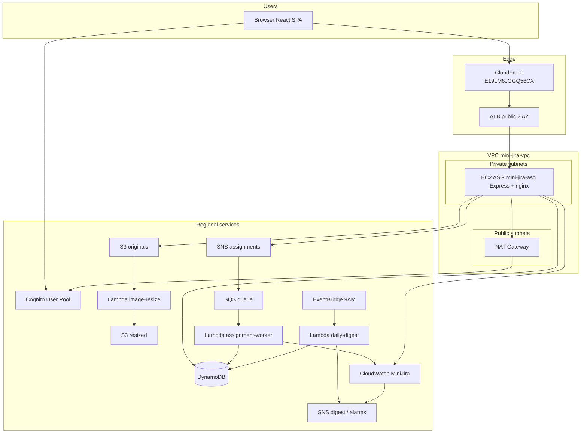

# Mini-Jira Architecture

## Overview

Mini-Jira is a team task-management app on AWS: React (Vite) via CloudFront, Express API on EC2 in an Auto Scaling Group behind an ALB, DynamoDB, S3, Cognito, and event-driven services (SNS, SQS, EventBridge, Lambda).

**Production URL:** [https://d2nnx11y19xl0z.cloudfront.net](https://d2nnx11y19xl0z.cloudfront.net)  
**Region:** `eu-north-1`

## Diagrams

| Document | Content |
|----------|---------|
| [architecture-diagram.svg](./architecture-diagram.svg) | 2-AZ VPC topology (public ALB/NAT, private EC2) |
| [ARCHITECTURE-DIAGRAM.md](./ARCHITECTURE-DIAGRAM.md) | Graded AWS-icon diagram instructions |
| Mermaid below | Service relationships |

## Network (deployed)

VPC `mini-jira-vpc` (`vpc-0839ece58c89264ca`): primary `10.0.0.0/24`, secondary `10.2.0.0/24`.

| Subnet | CIDR | Tier | Resources |
|--------|------|------|-----------|
| `mini-jira-public-1a` | `10.0.0.0/25` | Public | ALB, NAT 1a |
| `mini-jira-public-1b` | `10.0.0.128/25` | Public | ALB, NAT 1b |
| `mini-jira-private-1a` | `10.2.0.0/25` | Private | EC2 (ASG) |
| `mini-jira-private-1b` | `10.2.0.128/25` | Private | EC2 (ASG) |

- EC2: **no public IPs**; outbound via NAT (`nat-085b0e523088ab428` in 1a for both private subnets — cost-saving; per-AZ NAT optional).
- Admin: **SSM Session Manager** (`mini-jira-ec2-role` + `AmazonSSMManagedInstanceCore`), not SSH to instance public IP.

Migration runbook: [../infrastructure/VPC-PRIVATE-EC2-MIGRATION.md](../infrastructure/VPC-PRIVATE-EC2-MIGRATION.md).

## High-level flow (mermaid)



## DynamoDB tables

| Table | PK | SK / GSIs |
|-------|-----|-----------|
| Teams | teamId | — |
| Users | userId | GSI TeamIndex (teamId, name) |
| Projects | projectId | GSI TeamIndex (teamId, createdAt) |
| Tasks | taskId | GSI TeamIndex, GSI AssigneeIndex |
| Comments | taskId | commentId |
| TaskStatusAudit | taskId | auditKey |
| ActivityLog | date | logKey |

## Access control

- Cognito JWT on every API request; `custom:role`, `custom:teamId`.
- Employees: queries scoped by `teamId` (GSI + `assertTaskAccess`).
- Managers: bypass team filter.

## Demo scenario

- **Ali** (manager): creates Task A → Sara (frontend), Task B → Omar (backend); sees all tasks.
- **Sara:** frontend tasks only.
- **Omar:** backend tasks only.

Seed data: `backend` seed script (local or AWS).

## Monitoring (deployed)

| Item | Notes |
|------|--------|
| Namespace | `MiniJira` — `TasksCreated`, `TasksClosed`, `TasksAssignedPerTeam`, `TimeToCloseHours` (on Done), dimension `TeamId` |
| Dashboard | `MiniJira` — 4 widgets; JSON [../infrastructure/cloudwatch-dashboard.json](../infrastructure/cloudwatch-dashboard.json) |
| Alarm | `mini-jira-tasks-created-activity` → SNS `mini-jira-alarms` (activity; overdue in Analytics UI) |
| Digest | EventBridge `mini-jira-daily-digest-9am` → Lambda `mini-jira-daily-digest` |

**CloudWatch notes:** Custom metrics with dimensions need `TeamId` in dashboard metric arrays. `put-dashboard` JSON requires `region: "eu-north-1"` and `view: "timeSeries"` per widget.

## AWS lessons (VPC / ops)

- With primary CIDR `10.0.0.0/24`, you cannot add overlapping `10.0.1.0/24` or RFC1918 `172.16.0.0/24` as secondary; use `10.2.0.0/24` within `10.0.0.0/8`.
- Never deploy frontend by rsyncing Mac `dist/` with dev `.env` — build on EC2 with CloudFront Cognito URLs.

## Local development

```bash
docker compose up -d
cd backend && npm install && npm run create-tables && npm run seed && npm run dev
cd frontend && npm install && npm run dev
```

Use dev login when `DEV_AUTH=true` / `VITE_DEV_MOCK_LOGIN=true`.

## Related docs

- [COURSE-REQUIREMENTS.md](./COURSE-REQUIREMENTS.md)
- [../infrastructure/AWS-DEPLOYMENT.md](../infrastructure/AWS-DEPLOYMENT.md)
- [../README.md](../README.md) — production deploy steps
