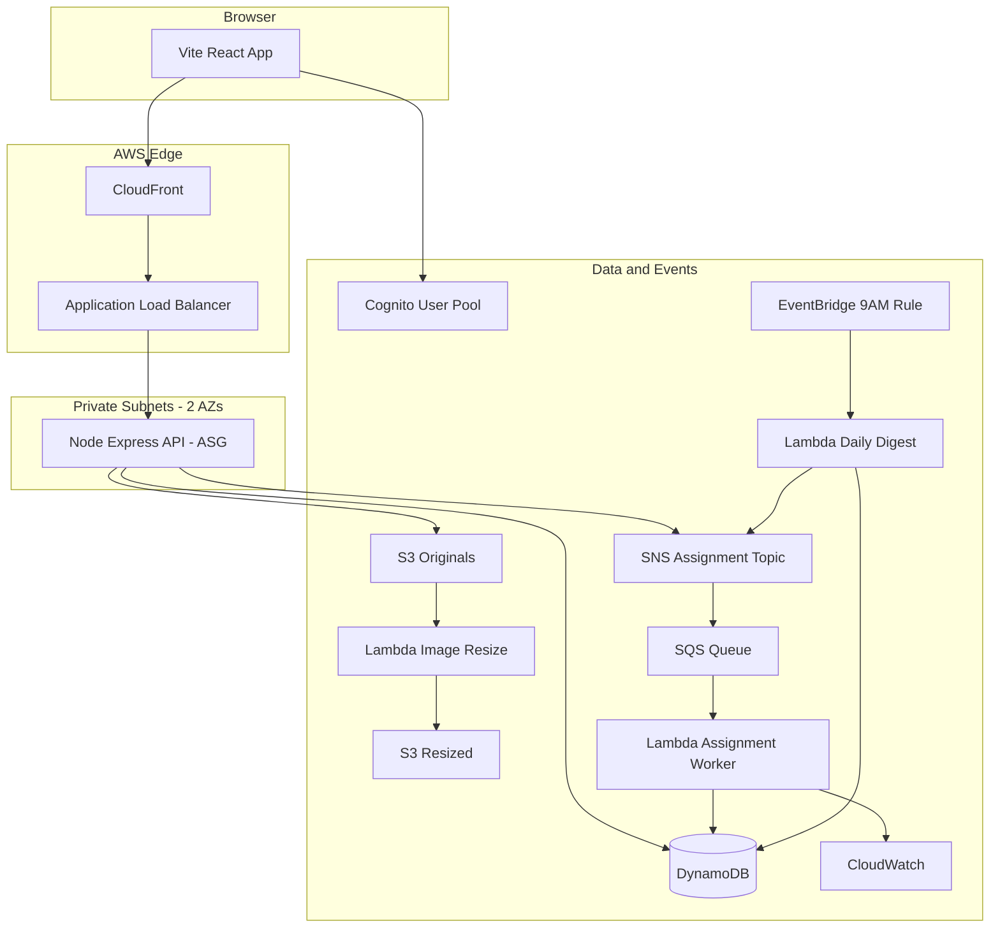

# Mini-Jira Architecture

## Overview

Mini-Jira is a team task-management application deployed on AWS with a React frontend and Express API on EC2, backed by DynamoDB, S3, Cognito, and event-driven services (SNS, SQS, EventBridge, Lambda).

## High-Level Diagram



## DynamoDB Tables

| Table | PK | SK / GSIs |
|-------|-----|-----------|
| Teams | teamId | — |
| Users | userId | GSI TeamIndex (teamId, name) |
| Projects | projectId | GSI TeamIndex (teamId, createdAt) |
| Tasks | taskId | GSI TeamIndex, GSI AssigneeIndex |
| Comments | taskId | commentId |
| TaskStatusAudit | taskId | auditKey |
| ActivityLog | date | logKey |

## Local Development

```bash
# Start DynamoDB Local
docker compose up -d

# Backend
cd backend && npm install
npm run create-tables
npm run seed
npm run dev

# Frontend (separate terminal)
cd frontend && npm install && npm run dev
```

Use dev login profiles (Ali / Sara / Omar) when `DEV_AUTH=true`.

## AWS Deployment Checklist

1. Cognito User Pool with `custom:role` and `custom:teamId`
2. DynamoDB tables (run `npm run create-tables` against AWS)
3. S3 buckets: originals + resized
4. SNS topic + SQS queue + email subscription
5. Lambdas: image-resize (S3 trigger), assignment-worker (SQS), daily-digest (EventBridge cron `cron(0 9 * * ? *)`)
6. EC2 ASG (min 2) in private subnets, ALB health check on `/health`
7. CloudFront distribution → ALB
8. CloudWatch dashboard + alarm on overdue tasks

## Demo Scenario

- **Ali** (manager): creates tasks, sees all teams
- **Sara** (frontend): sees only frontend team tasks
- **Omar** (backend): sees only backend team tasks

Seed script creates Task A (Sara) and Task B (Omar) for demo day.

## Public URL

After deployment, set CloudFront distribution URL as the working public link for course submission.
