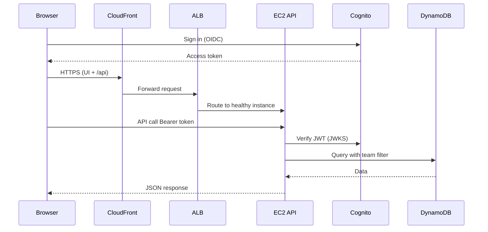

# AWS services reference

How each AWS component is used in Mini-Jira, what it connects to, and why it is there.

**Region:** `eu-north-1` · **Entry URL:** CloudFront → ALB → EC2

---

## At a glance

| Service | Role in Mini-Jira | Wired to | Main benefit |
|---------|-------------------|----------|--------------|
| **CloudFront** | Global HTTPS front door; caches static UI | Internet → ALB origin | Low latency, TLS at the edge, single public URL |
| **Application Load Balancer** | Routes HTTP to healthy EC2 instances | CloudFront → target group (EC2 :80) | HA across AZs, health checks, decouples DNS from instances |
| **EC2 (ASG)** | Runs Express API + nginx (React build) | ALB, NAT, DynamoDB, S3, SNS, Cognito APIs, CloudWatch | Full control of Node runtime; scales instance count |
| **Auto Scaling Group** | Keeps ≥2 instances in 2 AZs | Launch template, ALB target group, private subnets | Survives AZ/instance failure; rolling capacity |
| **VPC** | Isolated network for all compute | Subnets, IGW, NAT, SGs | Security boundaries; public vs private tiers |
| **NAT Gateway** | Outbound internet from private EC2 | Private subnets → public subnet NAT → IGW | EC2 without public IPs can reach AWS APIs and Cognito |
| **Cognito** | Sign-in, JWTs, `role` / `teamId` attributes | Browser (OIDC), API (`authMiddleware` JWT verify) | Managed auth; no custom password store |
| **DynamoDB** | All app data (tasks, users, teams, audit, activity) | Express repos, Lambdas | Serverless, fast key/GSI queries, pay per use |
| **S3 (originals)** | Task image uploads (versioned keys) | Browser presigned PUT → S3 event → resize Lambda | Durable blobs; offloads file storage from API |
| **S3 (resized)** | Thumbnails after processing | Resize Lambda writes; API presigned GET for UI | Smaller images in UI; async processing |
| **Lambda (image-resize)** | Resize on new upload | S3 PUT trigger → reads originals, writes resized, updates task row | CPU-heavy work off the API; event-driven |
| **SNS (assignments)** | Fan-out when a task is assigned | API `Publish` → email + SQS subscription | One publish, multiple consumers (notify + async worker) |
| **SQS** | Buffer assignment events | SNS → queue → assignment worker Lambda | Decouples API from slow work; retries, backpressure |
| **Lambda (assignment-worker)** | Background work on assign | SQS batch → ActivityLog + CloudWatch metric | Reliable audit trail without blocking HTTP response |
| **EventBridge** | Daily 9:00 schedule | Rule → digest Lambda | Cron without a server clock or cron on EC2 |
| **Lambda (daily-digest)** | Email tasks due today | Scan Tasks table → SNS digest topic | Proactive reminders per assignee |
| **SNS (digest / alarms)** | Email for digests; alarm notifications | Digest Lambda publish; CloudWatch alarm action | Simple email channel for ops and users |
| **CloudWatch (metrics)** | Custom KPIs + EC2 CPU | API + worker `PutMetricData`; dashboard widgets | Observable product usage and infra health |
| **CloudWatch (dashboard)** | Four graphs (created, closed, time-to-close, CPU) | Metrics in namespace `MiniJira` + `AWS/EC2` | Single pane for demo and ops |
| **CloudWatch (alarm)** | Alert on task-creation activity | Metric → SNS `mini-jira-alarms` | Automated signal when the system goes quiet or busy |
| **IAM** | Permissions for EC2 role and each Lambda | Instance profile + execution roles | Least privilege; no long-lived keys on servers |

---

## Traffic and auth flow

---

## By layer

### Edge and compute

| Service | How it works here | Connections | Why we use it |
|---------|-------------------|-------------|---------------|
| **CloudFront** | Distribution `E19LM6JGGQ56CX` serves the built React app and proxies API paths to the ALB. Invalidate `/*` after frontend deploy. | Origin: ALB DNS. Users only see the CloudFront hostname. | One stable URL for Cognito redirects and users; edge caching for static assets. |
| **ALB** | Listens in **public** subnets (1a + 1b). Target group checks `GET /health`. Forwards to nginx on port 80 on each instance. | Registered targets = private EC2 IPs. Security group allows 80/443 from internet (via CloudFront/AWS). | Multi-AZ load spreading; unhealthy instances removed automatically. |
| **EC2 + ASG** | `mini-jira-asg`, min 2. Launch template: no public IP, `pm2` runs `mini-jira-api`, nginx serves `/var/www/mini-jira/`. | Inbound: ALB only. Outbound: NAT → AWS APIs (DynamoDB, S3, SNS, Cognito, CloudWatch). Admin: **SSM Session Manager**. | Long-lived Node process; familiar deploy (`git pull`, `npm run build`). ASG replaces failed nodes. |
| **VPC / NAT** | `10.0.0.0/24` public (ALB + NAT), `10.2.0.0/24` private (EC2). Private route `0.0.0.0/0` → NAT. | IGW for public tier; NAT for private egress. | Course-style “private app tier”; reduces exposure of app servers to the internet. |

### Identity and data

| Service | How it works here | Connections | Why we use it |
|---------|-------------------|-------------|---------------|
| **Cognito** | SPA uses Hosted UI / OIDC. Pool `eu-north-1_0DPcA2AgE`, custom attributes `custom:role`, `custom:teamId`. API uses `aws-jwt-verify` on every protected route. | Frontend gets tokens; backend maps `sub` → DynamoDB user profile (`userProvisioning`). | No home-grown session DB; MFA/password policies available from AWS. |
| **DynamoDB** | Tables prefixed `mini-jira-` (Tasks, Users, Teams, Projects, Comments, TaskStatusAudit, ActivityLog). Tasks: GSIs on `teamId` and `assigneeId`. | All CRUD via `@aws-sdk/lib-dynamodb` in Express. Lambdas read/write Tasks and ActivityLog. | Fits item-per-task model; GSIs power team-scoped lists and assignee queries. |
| **S3 originals** | API returns presigned **PUT** URL; key pattern `tasks/{taskId}/v{n}/...`. Block public access; EC2/Lambda access via IAM. | PUT completes → S3 event notification invokes resize Lambda. | Large uploads never stream through Express memory; versioned keys keep history. |
| **S3 resized** | Resize Lambda writes JPEG thumbnail; task record stores `resizedKey`. API issues presigned **GET** for the UI. | Fed by resize Lambda; read by browser via API-generated URL. | Kanban/detail views load small images quickly. |

### Event-driven pipeline

| Step | Service | What happens |
|------|---------|----------------|
| 1 | **Express** | Manager creates/assigns task → `publishTaskAssignment()` |
| 2 | **SNS** `mini-jira-task-assignments` | One message with JSON payload + human-readable email body |
| 3a | **Email subscription** | Assignee gets “task assigned” mail (per-user filter on `assigneeId` where configured) |
| 3b | **SQS** | SNS subscription enqueues the same event |
| 4 | **Lambda** `mini-jira-assignment-worker` | Polls SQS → writes `ActivityLog` row → `PutMetricData` `TasksAssignedPerTeam` |
| 5 | **CloudWatch** | Dashboard and alarms can use assignment + create/close metrics |

**Assign flow (code):** `backend/src/routes/tasks.ts` → `backend/src/services/events.ts` → SNS topic ARN from env `SNS_ASSIGNMENT_TOPIC_ARN`.

| Service | How it works here | Connections | Why we use it |
|---------|-------------------|-------------|---------------|
| **SNS** | Topics: assignments (fan-out), daily digest, alarms. API publishes assignments; digest Lambda publishes digest. | Subscribers: email, SQS (assignments), alarm actions. | Pub/sub: add a consumer without changing the API contract. |
| **SQS** | Queue subscribed to assignment topic; visibility timeout 60s. | SNS → SQS → Lambda event source mapping. | If the worker is slow or down, messages accumulate safely instead of failing the HTTP request. |
| **Lambda (assignment-worker)** | Parses SNS-wrapped SQS body; idempotent log + metric per message. | IAM: DynamoDB put, CloudWatch put. | Keeps request latency low; audit and metrics still happen reliably. |
| **EventBridge** | Rule `mini-jira-daily-digest-9am`: `cron(0 9 * * ? *)`. | Target: digest Lambda. | Serverless scheduler; no cron daemon on EC2. |
| **Lambda (daily-digest)** | Scans tasks where `deadline === today` and status ≠ done; groups by assignee; SNS email per person. | Reads Tasks table; publishes to digest topic. | Daily reminder without user opening the app. |
| **Lambda (image-resize)** | Triggered by S3 PUT on originals bucket; `sharp` resize; updates `imageKeys` on task. | Read originals bucket; write resized bucket; UpdateItem on Tasks. | Heavy image CPU off API; scales to zero when idle. |

### Observability

| Metric | Published when | Dimension |
|--------|----------------|-----------|
| `TasksCreated` | Task created | `TeamId` |
| `TasksClosed` | Status → done | `TeamId` |
| `TimeToCloseHours` | Status → done (hours since `createdAt`) | `TeamId` |
| `TasksAssignedPerTeam` | Assignment worker processes SNS/SQS event | `TeamId` |
| `CPUUtilization` | (AWS default) | `AutoScalingGroupName` = `mini-jira-asg` |

| Service | How it works here | Connections | Why we use it |
|---------|-------------------|-------------|---------------|
| **CloudWatch metrics** | Namespace `MiniJira`; API calls `putMetric` / `recordTimeToClose`; worker publishes assignment metric. | EC2/Lambda IAM `cloudwatch:PutMetricData`. | Product analytics (throughput, time-to-close) alongside infra metrics. |
| **CloudWatch dashboard** | `MiniJira` — JSON in `infrastructure/cloudwatch-dashboard.json`. | Plots custom metrics with `TeamId` + EC2 CPU for ASG. | Operators see health and usage in one console view. |
| **CloudWatch alarm** | `mini-jira-tasks-created-activity` on activity metric → SNS `mini-jira-alarms`. | SNS email for ops. | Early warning if the app stops creating tasks (or unusual spikes, depending on threshold). |

### Security (IAM)

| Principal | Typical permissions |
|-----------|---------------------|
| **EC2** `mini-jira-ec2-role` | DynamoDB read/write, S3 presign buckets, SNS publish assignments, CloudWatch PutMetricData, SSM core, CloudFront invalidation (optional) |
| **Lambda roles** | Scoped per function: S3 read/write (resize), DynamoDB + CloudWatch (worker), DynamoDB + SNS (digest) |
| **Human admin** | IAM user for deploy, dashboard upload, VPC changes — not on instances |

**Benefit:** Instances and Lambdas assume roles temporarily; no access keys in the repo or on disk.

---

## End-to-end examples

### Create task with image

1. User (Cognito JWT) → CloudFront → ALB → EC2 creates task in **DynamoDB**, metric `TasksCreated`.
2. EC2 returns presigned PUT → browser uploads to **S3 originals**.
3. **S3** event → **Lambda resize** → **S3 resized** + task row updated.
4. If assignee set: **SNS** → email + **SQS** → **worker Lambda** → **ActivityLog** + metric.

### Mark task done

1. PATCH status → **DynamoDB** + audit row.
2. `TasksClosed` + `TimeToCloseHours` → **CloudWatch**.
3. UI refreshes from API (still via CloudFront → ALB → EC2).

### Morning digest

1. **EventBridge** fires at 09:00 UTC (cron expression uses EventBridge’s scheduler).
2. **Digest Lambda** scans **DynamoDB** Tasks → **SNS digest** → email per assignee with tasks due that day.

---

## Local development vs AWS

| Capability | Local | AWS |
|------------|-------|-----|
| Database | DynamoDB Local (Docker) | DynamoDB |
| Auth | `DEV_AUTH` mock users | Cognito JWT |
| Events | `EVENTS_ENABLED=false` (no SNS) | Full SNS → SQS → Lambda chain |
| Images | Optional/minimal S3 | Full S3 + resize Lambda |
| Metrics | Logged warning if no creds | `PutMetricData` from EC2/Lambda |

---

## Related docs

- [ARCHITECTURE.md](./ARCHITECTURE.md) — tables, GSIs, mermaid system diagram  
- [architecture-diagram.svg](./architecture-diagram.svg) — network topology  
- [../infrastructure/README.md](../infrastructure/README.md) — resource names and deploy commands
